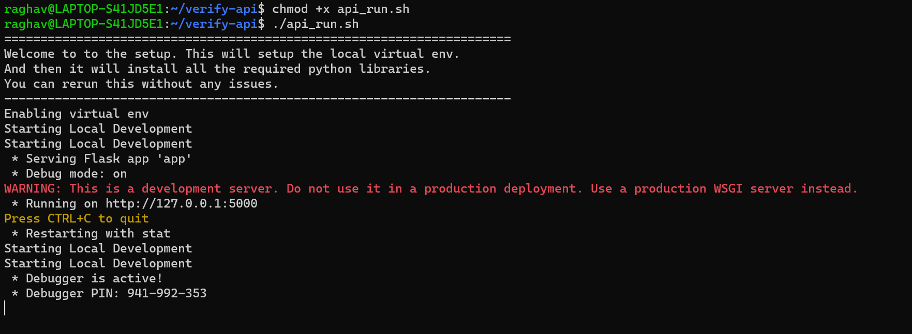

# Flask API for Degree Verification

This Flask API allows you to verify academic degrees from images. Follow the steps below to set up and run the API.

## Prerequisites

- Python 3.x
- WSL or Linux environment

## Setup

### Step 1: Make the setup scripts executable

```bash
chmod +x local_setup.sh
```

### Step 2: Run the local setup script

```bash
./local_setup.sh
```


### Step 3: Make the API run script executable

```bash
chmod +x api_run.sh
```

### Step 4: Run the API

```bash
./api_run.sh
```



## Testing the API

You can test the API using `curl` or a tool like Postman.

### Using `curl`

Send a POST request with an image file to the `/verify` endpoint:

```bash
curl -F "file=@/home/user/<PATH_TO_IMG>" http://127.0.0.1:5000/verify
```

Make sure to replace `<PATH_TO_IMG>` with the actual path to the image you want to verify.


### Using Postman

1. Open Postman.
2. Create a new POST request.
3. Set the request URL to `http://127.0.0.1:5000/verify`.
4. In the request body, select `form-data`.
5. Add a key-value pair with the key as `file` and select the image file for the value.
6. Add a header with `Content-Type` set to `multipart/form-data`.
7. Click the "Send" button to make the request.

The API will respond with the verification results.


## API Documentation
For detailed API documentation and usage, refer to the API documentation [here](./api_documentation.md).